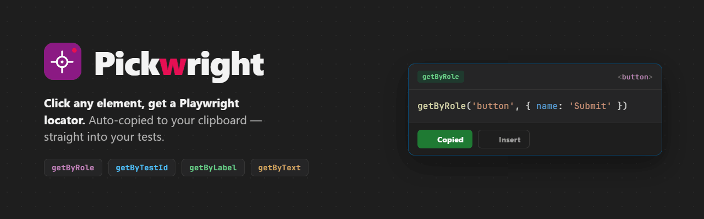

# Pickwright



A Manifest V3 browser extension for **Chrome** and **Firefox** that lets you pick any element on a page and generates a Playwright-friendly locator, ready to paste into your test code.

## Features

- **Element Picker** — hover to highlight, click to select without triggering page actions
- **Playwright Locators** — generates `getByTestId`, `getByRole`, `getByLabel`, `getByPlaceholder`, `getByText`, and CSS fallback locators
- **Smart Scoring** — ranks candidates by stability, accessibility, and uniqueness
- **Clipboard Copy** — selected locator is instantly copied to clipboard with a toast confirmation
- **Recent History** — last 20 locators stored for quick reuse
- **Angular Support** — detects dropdown triggers, formcontrolname, and ng-reflect-* attributes without triggering UI changes
- **Shadow DOM** — traverses open shadow roots for accurate element targeting
- **Iframe Support** — fully highlights and selects elements inside same-origin frames (prepends `frameLocator('...')` prefix; cross-origin frames fall back to the frame boundary itself)

## Installation

### Step 1 — Clone and build

```bash
git clone https://github.com/your-org/pickwright.git
cd pickwright
npm install
npm run build
```

This produces a `dist/` folder — that's the unpacked extension you load into your browser. The same `dist/` works in both Chrome and Firefox.

### Step 2 — Load into Chrome

1. Open Chrome and go to **`chrome://extensions`**
2. Enable **Developer mode** using the toggle in the top-right corner
3. Click **Load unpacked**
4. Select the **`dist/`** folder inside the project (e.g. `C:\Github\Pickwright\dist`)
5. Pickwright appears in your extensions list — pin it via the puzzle-piece icon in the toolbar for easy access

> **Note:** You must reload the extension (`chrome://extensions` → refresh icon) and refresh the target page any time you rebuild.

### Step 2 (alt) — Load into Firefox

1. Open Firefox and go to **`about:debugging#/runtime/this-firefox`**
2. Click **Load Temporary Add-on…**
3. Select the **`dist/manifest.json`** file (not the folder) inside the project
4. Pickwright appears under **Temporary Extensions** and is pinned to the toolbar

> **Note:** Temporary add-ons are removed when Firefox restarts — reload them the same way after each restart. After rebuilding, click **Reload** on the add-on in `about:debugging` and refresh the target page. Requires Firefox 121 or later.

## Usage

1. Navigate to any webpage (does **not** work on `chrome://` or `chrome-extension://` pages)
2. Click the **Pickwright** icon in the toolbar
3. Click **Pick element** — the button switches to **Stop picking** and your cursor changes to a crosshair
4. Hover over elements — a blue highlight box follows your cursor with a tag/class tooltip
5. **Click any element** to:
   - Generate the best Playwright locator
   - Copy it to clipboard automatically
   - See a toast confirmation in the bottom-right corner
6. Press **Esc** at any time to cancel picking mode
7. Reopen the popup to see the **last captured locator** plus your **recent history** (scrollable, last 20) — click any entry to recopy it

### Generated Locator Priority

Locators are generated and scored in this order (highest priority first):

| Priority | Strategy | Example |
|----------|----------|---------|
| 1 | `getByTestId` | `getByTestId('submit-btn')` |
| 2 | `getByRole` + name | `getByRole('button', { name: 'Submit' })` |
| 3 | `getByLabel` | `getByLabel('Email address')` |
| 4 | `getByPlaceholder` | `getByPlaceholder('Search...')` |
| 5 | `getByText` | `getByText('Sign in')` |
| 6 | CSS fallback | `locator('#login-form > button')` |

## Development

### Prerequisites

- Node.js 18+
- npm 9+

### Commands

| Command | Description |
|---------|-------------|
| `npm run build` | Production build → `dist/` |
| `npm run dev` | Development build with watch mode |
| `npm run lint` | Run ESLint on source files |
| `npm run format` | Format code with Prettier |
| `npm run test` | Run Playwright E2E tests |

### Development Workflow

1. Run `npm run dev` — webpack watches for changes and rebuilds automatically
2. Edit files in `src/`
3. Go to `chrome://extensions` and click the **refresh icon** on Pickwright
4. Refresh the target page and test

### Automated E2E Testing

The project includes an automated End-to-End (E2E) test suite powered by **Playwright** that verifies the React popup, background relay, content script overlay, locator scoring engine, and iframe parsing.

To execute the tests locally:
1. Install Playwright's Chromium browser (required once):
   ```bash
   npx playwright install chromium
   ```
2. Run the test suite (this automatically builds the extension first):
   ```bash
   npm run test
   ```
The test runs Chromium in headed mode using a persistent profile, mounts the unpacked extension, hosts a local mock HTML test page, and runs all assertions.

## Configuration

### Manifest Permissions

| Permission | Purpose |
|-----------|---------|
| `activeTab` | Access the active tab for element picking |
| `storage` | Persist recent locator history |

### Supported Test ID Attributes

The extension recognizes these as stable "test id"-style attributes:
- `data-testid` (generated as `getByTestId(...)` by default)
- `data-test-id`
- `data-cy`

> **Note:** `data-test-id` and `data-cy` are emitted as `locator('[data-test-id="..."]')` CSS selectors. To use `getByTestId(...)` for these, configure [`testIdAttribute`](https://playwright.dev/docs/api/class-playwrightassertions) in your Playwright config.

## Troubleshooting

- **Extension fails to load**: Ensure you loaded the compiled `dist/` directory, not the project root. Run `npm run build` first.
- **Picker doesn't activate or highlight**: Refresh the page after reloading the extension. Content scripts are blocked on `chrome://` and Chrome Web Store pages.
- **Wrong element targeted**: Elements inside **closed** shadow roots or cross-origin iframes have restricted access. The picker will target the shadow host or iframe boundary.
- **Clipboard is empty**: If clipboard copy fails, check the page's console for Content Security Policy (CSP) restriction blocks.


## Browser Compatibility

- Chrome 88+ (Manifest V3)
- Edge 88+ (Chromium-based)
- Firefox 121+ (Manifest V3)
- Other Chromium browsers with MV3 support

## License

MIT
