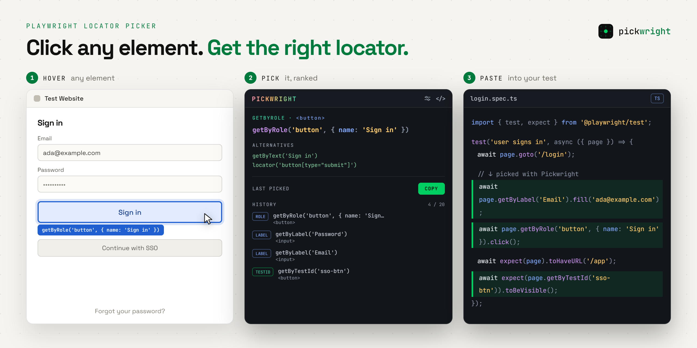

# Pickwright

  
  

A Manifest V3 browser extension for **Chrome** and **Firefox** that lets you pick any element on a page and generates a Playwright-friendly locator, ready to paste into your test code.

## Features

- **Element Picker** — hover, highlight, and select elements without triggering page actions
- **Playwright Locators** — generates locators from test IDs, accessibility attributes, and CSS fallbacks
- **Smart Scoring** — ranks candidates by stability, accessibility, and uniqueness
- **History & Settings** — copies locators automatically, stores the last 20, supports alternatives and multi-pick, and offers theme and history controls
- **Advanced Support** — keyboard shortcut, dropdown picking, Angular controls, open Shadow DOM, and same-origin iframe support

## Installation

Install from the official stores:

- **[Chrome Web Store](https://chromewebstore.google.com/detail/pickwright-playwright-loc/kgikopoehffaodbicnhajokkmhgjofjo)** — for Chrome and Edge
- **[Firefox Add-ons](https://addons.mozilla.org/en-US/firefox/addon/pickwright/)** — for Firefox

Manual install

Prefer to load it yourself, or need a pre-release build? Download the package for your browser from the [latest release](https://github.com/MithunWijayasiri/Pickwright/releases/latest).

### Chrome / Edge

1. Download **`pickwright-chrome-v<version>.zip`** and unzip it into a permanent folder.
2. Open **`chrome://extensions`** (on Edge, **`edge://extensions`**).
3. Enable **Developer mode**, click **Load unpacked**, and select the unzipped folder.

### Firefox

1. Download **`pickwright-firefox-v<version>.xpi`**.
2. Open **`about:addons`** in Firefox.
3. Click the gear icon → **Install Add-on From File…**, select the `.xpi`, and confirm.

The `.xpi` is signed, so it stays installed across restarts. Requires Firefox 140 or later.

&nbsp;

> **Want the latest unreleased changes, or developing the extension?** See [Build From Source](docs/build-from-source.md).

## Usage

1. Open any webpage (browser-internal and Chrome Web Store pages are unsupported).
2. Open the **Pickwright** popup and select **Pick element**.
3. Hover over an element and click it.
4. Pickwright generates and copies the best Playwright locator. Reopen the popup to view recent history.

### Picking several elements

Click **Pick multiple** to keep picking across clicks. Each selection is copied and added to history until you press **Stop picking** or **Esc**. History must be enabled.

### Settings

Open the gear icon to choose a light or dark theme and set history to **Keep**, **Auto-clear**, or **Off**.

### Generated Locator Priority

See [Generated Locator Priority](docs/build-from-source.md#generated-locator-priority) for the scoring order and examples. Candidates must match exactly one element; `.nth(n)` is reserved for ambiguous unnamed role matches.

## Development

Build commands, the development workflow, E2E testing, and configuration details (manifest permissions, supported test-ID attributes) live in [Build From Source](docs/build-from-source.md).

## Troubleshooting

- **Extension fails to load**: Run `npm run build` and load `dist/`, not the project root.
- **Picker doesn't activate**: Reload the extension and refresh the target page. Browser-internal and Chrome Web Store pages are unsupported.
- **Wrong element or empty clipboard**: Closed shadow roots and cross-origin iframes have restricted access. For clipboard issues, check the page console for CSP errors.

## Browser Compatibility

Chrome 88+, Edge 88+, Firefox 140+, and other Chromium browsers with Manifest V3 support.

## Contributing

Contributions are welcome! To get started:

1. Check the [issues](https://github.com/MithunWijayasiri/Pickwright/issues) for something to work on, or open a new one to discuss your idea first.
2. Fork the repo and set up your dev environment — see [Build From Source](docs/build-from-source.md).
3. Create a branch off `master` and make your change — CI runs lint and the E2E suite on every PR.
4. Open a pull request against `master` with a clear description of what changed and why.

Please keep PRs focused and follow the existing code style (enforced via ESLint + Prettier).

> [!NOTE]
> AI-assisted contributions are welcome. Please understand and verify your changes before submitting a pull request.

## Privacy

Pickwright never sends your data anywhere. Selection history is stored only in your browser using the extension's local storage. You can choose to keep it between sessions, clear it on startup, or disable history entirely. See the full [Privacy Policy](docs/PRIVACY.md).

## Support

If you find this project useful, consider supporting its development on [Ko-fi](https://ko-fi.com/mithunwijayasiri). Your donations help keep the project maintained, improve existing features, and fund new open-source tools.

Thank you for your support! ❤️

## License

MIT
